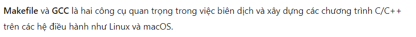

# Makefile
---





Dù viết là 1 nhưng 1 ở đây là ký tự chứ không phải số nguyên

Lệnh để xem predefined variable values


wildcard và patsubst đều là hàm trong makefile
patsubst là viết tắt của path substitution


Sẽ ra sao khi các file source nằm trong thư mục riêng và file header nằm ở một thư mục riêng?

makefile sẽ nằm ở ngoài cùng nhé

Sử dụng slash


-I để compiler biết nhìn vào đâu để tìm các file include


Chưa có folder build thì tạo mới

Thêm các điều kiện về warning

.PHONY để làm gì


```makefile
# Đường dẫn tới các thư mục
SRC_DIR = src
INC_DIR = include
BUILD_DIR = build

# Danh sách tất cả các file nguồn (.c) trong các thư mục
SRCS = $(shell find $(SRC_DIR) -name '*.c')

# Danh sách tất cả các file tiêu đề (.h) trong các thư mục
HEADERS = $(shell find $(SRC_DIR) -name '*.h') $(shell find $(INC_DIR) -name '*.h')

# Tạo tên file thực thi từ tên file đầu vào
TARGET = $(BUILD_DIR)/app

# Biến cho trình biên dịch và các tùy chọn
CC = gcc
CFLAGS = -I$(INC_DIR) -I$(SRC_DIR) -Wall -g

# Danh sách các file đối tượng (.o)
OBJS = $(SRCS:$(SRC_DIR)/%.c=$(BUILD_DIR)/%.o)

# Mục tiêu mặc định
all: $(TARGET)

# Quy tắc để tạo file thực thi
$(TARGET): $(OBJS)
	$(CC) -o $@ $^

# Quy tắc để tạo file đối tượng từ file nguồn
$(BUILD_DIR)/%.o: $(SRC_DIR)/%.c
	$(CC) $(CFLAGS) -c $< -o $@

# Mục tiêu để xóa các file biên dịch
clean:
	rm -f $(BUILD_DIR)/*.o $(TARGET)

.PHONY: all clean
```

